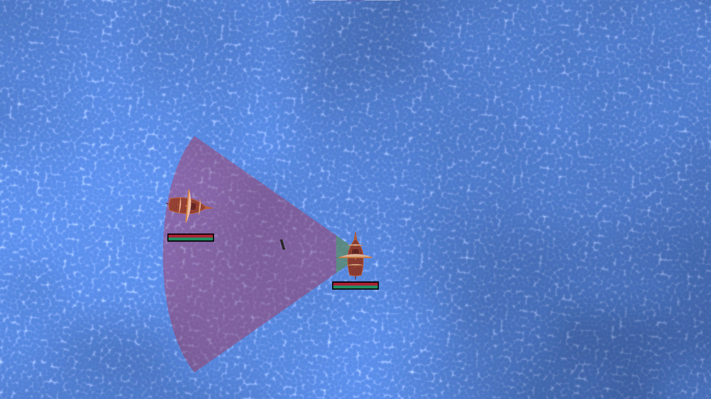
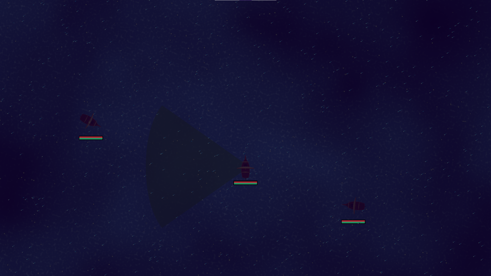
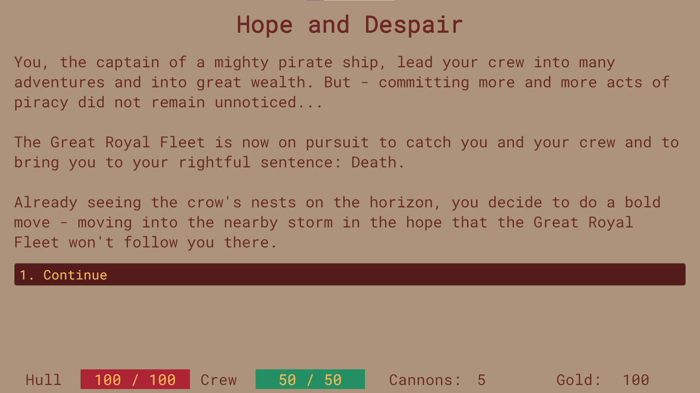
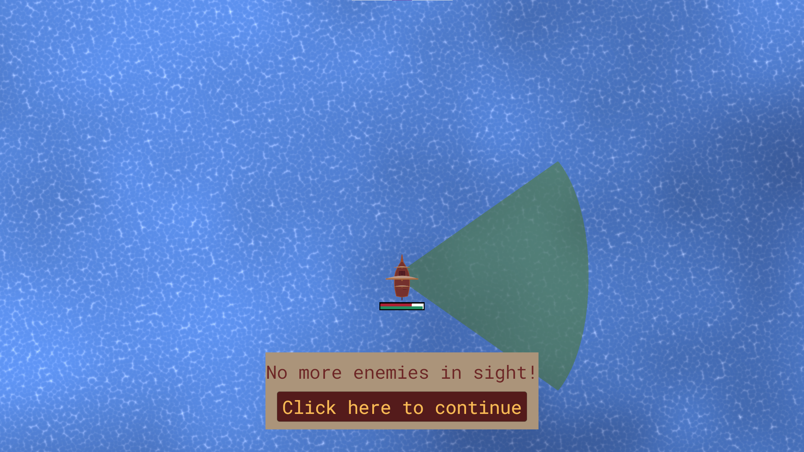

**NOTICE: This game was made during [Ludum Dare 48](https://ldjam.com/events/ludum-dare/48/storm-last-resort).**
**What does this mean? This is jam code, so it isn't very clean, it gets the job done. If you have any questions feel free to contact me.**   

# Storm: Last Resort

In **Storm: Last Resort** you play as the captain of a pirate ship. You plundered and struck fear in the heart of many people of the Caribbean. This, of course, did not remain unnoticed and so you find yourself in an invidious situation.

# Gameplay

In the game you steer a ship in a top-down view and have to beat the enemies in fight. You can set and strike sails with W and S, steer with A and D and fire your cannons by left-clicking in the firing arc.

Between the battles there are small events and story parts where you choose upgrades for your ship.

# Gameplay hints

If you struggle with the fights, here are some hints:

- following ships isn't a particularly great idea, they will get the better of you
- if a ship is damaged it will move more slowly
- if the crew of a ship takes damage, they won't be able to reload as fast as usual
- after you lost a battle, you can choose to try again or even let your ship and crew be healed/repaired and try again

# Ludum Dare Notes

This game is a jam submission for Ludum Dare 48 and was made in the time of 72 hours, I think I spent around 45 hours actively working on it.

This time I switched back to Unity to develop the game (more about this in my post-mortem, if I manage to write one). Sadly I had no time to make any music, the sounds are mixed and edited from the #GameAudioGDC Bundles, thus I won't take any ratings in the audio category. All the graphics are made by myself.

# [Play the game on itch.io](https://skosnowich.itch.io/storm-last-resort)

------------

# Screenshots

# Full Gameplay Video

https://www.youtube.com/watch?v=Lp_MqMy8nrw
